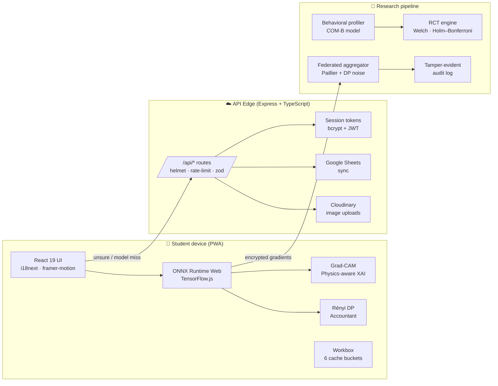

# BMO Robot — Phân loại rác thông minh

[](LICENSE)
[](https://creativecommons.org/licenses/by/4.0/)
[](package.json)
[](tsconfig.json)
[](vite.config.ts)
[](tests/)

> **A privacy-first, federated, offline-capable PWA that teaches Vietnamese
> students to sort household waste using on-device AI — built for the
> International Science & Engineering Fair (ISEF).**

BMO Robot is more than a waste-sorting game: every scan runs through a
TensorFlow.js / ONNX model on the student's phone first, with a fallback
to Gemini cloud vision only when the local model is unsure. Behavioral
data (scans, quizzes, family challenges) feeds an on-device Rényi
Differential Privacy budget and a Federated Learning pipeline so the
global model improves without any raw image leaving the device. A
RCT-grade research module runs Randomized Controlled Trials with
Welch's t-tests, Holm–Bonferroni correction, mediation bootstrap, and a
Theory-of-Change evaluation aligned with the COM-B model of behavior
change.

---

## ✨ Highlights

| Area                          | What you get                                                                                                                                |
| ----------------------------- | ------------------------------------------------------------------------------------------------------------------------------------------- |
| 🧠 On-device AI               | MobileNetV2 / EfficientNet-Lite / ONNX classification; YOLOv8n detection; Grad-CAM / physics-aware XAI                                      |
| 🛡️ Privacy engineering        | Rényi Differential Privacy accountant, Paillier-style secure aggregation, audit trail, no PII collected                                     |
| 🌐 Offline-first              | Workbox PWA with 6 caching buckets (app-shell, models, API, images), background sync, installable on Android/iOS                           |
| 🎮 Gamification               | Cards, shards, clans, weekly tournaments, PvP arena, family mode, streak system, AR mini-games                                            |
| 🧪 Research-grade             | RCT engine (Welch, Holm–Bonferroni), social network PageRank, novelty-decay detector, weekly reflection, longitudinal analytics            |
| 🏗️ Production-ready           | Express API with contract types shared between client & server (`apiContract.ts`), zod validation, rate-limit, helmet, structured logging    |
| 🤝 Open dataset               | CC-BY-4.0 community dataset for Vietnamese waste with auto-label + cross-check review pipeline                                           |

---

## 🚀 Quick start (5 minutes)

> Requires **Node.js 20 or 22** and **npm 10+**.

```bash
# 1. Clone & install
git clone https://github.com/<your-org>/bmo-robot---ph-n-lo-i-r-c.git
cd bmo-robot---ph-n-lo-i-r-c
npm install

# 2. Configure secrets
cp .env.example .env
# then edit .env and fill in GEMINI_API_KEY + at least SUPABASE_URL +
# SUPABASE_SERVICE_ROLE_KEY (or set RESEARCH_DB_ENABLED=false for a
# server-only demo without persistent storage)

# 3. Run dev server (Vite + Express on :3000, HMR :5173)
npm run dev
```

Open <http://localhost:5173>. Log in with any nickname (the default
admin uses `ADMIN_API_KEY` from `.env`).

### Build & start production

```bash
npm run build      # bundles SPA to dist/ + server to dist/server.cjs
npm start          # node dist/server.cjs on PORT (default 3000)
```

---

## 📦 Scripts

| Script             | Purpose                                                                       |
| ------------------ | ----------------------------------------------------------------------------- |
| `npm run dev`      | Vite dev server (HMR) + Express API via `tsx`                                |
| `npm run build`    | Production bundle (Vite + esbuild → `dist/`)                                 |
| `npm start`        | Run the prebuilt server in `dist/server.cjs`                                  |
| `npm test`         | Run vitest + `node:test` specs                                                |
| `npm run lint`     | `tsc --noEmit` type-check                                                     |
| `npm run check:paths` | Detect mixed-slash or case-collision filenames (CI-safe, no auto-delete)   |
| `npm run preview`  | Vite preview of the production build                                          |
| `npm run clean`    | Remove `dist/`                                                                |

---

## 🏛️ Architecture



---

## 📁 Project layout

```
.
├── server/                # Express API + services
│   ├── bootstrap.ts       # All routes mounted here (entry-point wired by server.ts)
│   ├── routes/            # Per-domain routers (federated, vision, family, …)
│   ├── services/          # RCT, DP, federated, audit, vision pipeline, …
│   ├── auth.ts            # Session token utilities
│   ├── schema.ts          # PostgreSQL schema (Supabase)
│   └── sheetsSync.ts      # Google Sheets ↔ DB sync
├── src/                   # React 19 PWA client
│   ├── components/        # AIScanner, Chatbot, AdminDashboard, …
│   ├── services/          # localModelRunner, inferenceRouter, dpAccountant, …
│   ├── workers/           # federatedWorker, federatedWorkerPure
│   ├── hooks/             # useFederatedTraining, useInference, …
│   └── apiContract.ts     # Shared TS types between client & server
├── tests/                 # vitest + node:test specs
├── public/                # Static assets (icons, models)
├── scripts/               # download-models.js, benchmark_models.py, smoke.sh, …
├── docs/                  # Architecture Decision Records, user guides, research
│   ├── adr/               # ADR-0001 … ADR-0005
│   └── research/          # Research proposal & dataset release notes
└── reports/               # Generated benchmark + RCT reports
```

---

## 🤝 Contributing

We welcome contributions to:

1. **Dataset curation** — submit photos of Vietnamese household waste via
   the in-app "Đóng góp" flow, or follow [CONTRIBUTING.md](CONTRIBUTING.md).
2. **AI model improvements** — fine-tune the on-device classifier and
   open a PR with benchmark results (see [`reports/benchmark_vs_dwaste.md`](reports/benchmark_vs_dwaste.md)).
3. **Privacy research** — propose tighter DP mechanisms, audit-trail
   upgrades, or alternate secure-aggregation primitives.

Code is **MIT-licensed**; the dataset is **CC-BY-4.0**. By contributing you
agree to the contributor license agreement in [CONTRIBUTING.md](CONTRIBUTING.md).

---

## 📜 License & citation

- **Source code:** [MIT](LICENSE)
- **Dataset:** [CC-BY-4.0](https://creativecommons.org/licenses/by/4.0/)
- **Privacy:** Rényi-DP accountant + Paillier secure aggregation; no
  personal data is collected without explicit consent (see the
  in-app "Quyền riêng tư" panel and `docs/adr/0002-renyi-dp.md`).

### Citing this project (ISEF paper)

```bibtex
@misc{bmo2026,
  title  = {BMO Robot: A privacy-first federated PWA for waste-sorting education in Vietnam},
  author = {BMO Robot Contributors},
  year   = {2026},
  url    = {https://github.com/<your-org>/bmo-robot---ph-n-lo-i-r-c},
  note   = {ISEF project, International Science \& Engineering Fair}
}
```

---

## 📚 Further reading

- [DEPLOYMENT.md](DEPLOYMENT.md) — full deployment guide (Docker, Railway, Render, Raspberry Pi, Hugging Face Spaces)
- [CONTRIBUTING.md](CONTRIBUTING.md) — dataset contribution workflow
- [docs/research/RESEARCH_PROPOSAL.md](docs/research/RESEARCH_PROPOSAL.md) — research methodology
- [docs/adr/](docs/adr/) — Architecture Decision Records (on-device-first, Rényi DP, Paillier, COM-B, PWA)
- [scripts/smoke.sh](scripts/smoke.sh) — end-to-end smoke test
- [public/models/README.md](public/models/README.md) — ONNX model provenance & SHA-256 manifest

<div align="center">
<sub>Built with ❤️ for the next generation of eco-citizens.</sub>
</div>