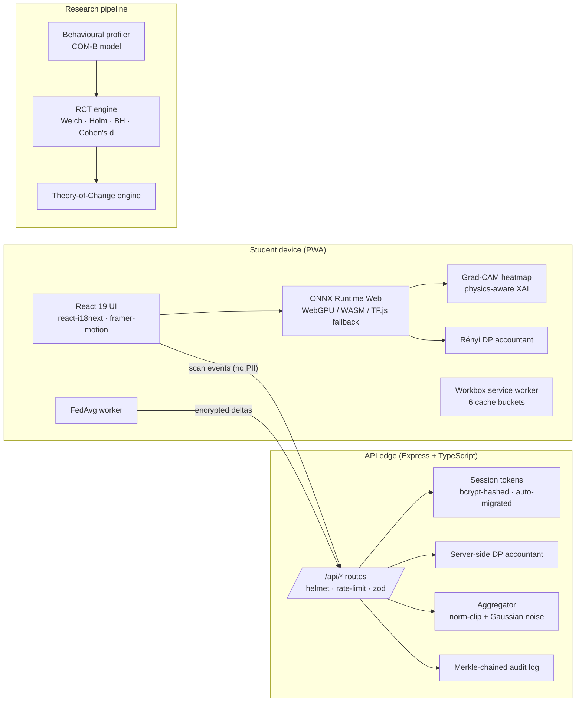

# BMO Robot — Vietnamese Waste Sorting (PWA)

[](LICENSE) [](DATASET_LICENSE.md)
[](package.json)
[](tsconfig.json)
[](vite.config.ts)
[](https://github.com/duckycreater/nckh/actions/workflows/ci.yml)

BMO Robot is a **privacy-first, federated, offline-capable PWA** that teaches
Vietnamese students to sort household waste using **on-device AI** (ONNX
classifier bundled into the browser). Behavioural data — scans, quizzes,
family challenges — feeds an **on-device Rényi Differential-Privacy budget**
and a **Federated Learning pipeline** so the global model improves without
any raw image leaving the device.

> Status: research scaffold. The platform is fully implemented and
> demonstrable in a browser; the randomisation-controlled-trial numbers in
> `reports/` are **synthetic demonstration values** until IRB approval and a
> multi-school pilot complete. See §"What is real, what is simulated" below.

---

## What ships today

| Area | What's actually in the repo | Where to look |
| ---- | --------------------------- | ------------- |
| On-device classifier | ONNX `waste_classifier_v1.onnx` (16-feature MLP, 1920 synthetic-centroid training samples) + WebGPU/WASM inference router + Grad-CAM heatmaps | `public/models/`, `src/services/inferenceRouter.ts`, `src/services/wasteClassifier.ts` |
| Privacy stack | Rényi DP accountant (Gaussian mechanism) + Paillier-style homomorphic aggregation primitives + Merkle-chained audit log | `src/services/dpAccountant.ts`, `src/services/secureAggregation.ts`, `src/services/auditTrail.ts` |
| Federated Learning | FedAvg client-side trainer (Web Worker) + server-side aggregator with norm-clip + DP noise + non-IID Dirichlet partitioning | `src/workers/federatedWorker.ts`, `server/services/federatedAggregator.ts` |
| Gamification | Cards / shards / clans / weekly tournaments / PvP arena / family mode / streak / AR mini-games | `src/components/Flashcards.tsx`, `src/components/WorldMap.tsx`, `src/components/CampaignStage.tsx` |
| Research methods | Welch's t-test, Holm–Bonferroni + Benjamini–Hochberg FDR, Cohen's d, mediation bootstrap, Theory-of-Change evaluation aligned with COM-B | `server/services/rctEngine.ts`, `server/services/mediationAnalysis.ts` |
| Production API | Express + zod + helmet + rate-limit + structured logging + 10-locale error messages + shared `apiContract.ts` types | `server/bootstrap.ts`, `server/middleware/security.ts`, `src/apiContract.ts` |
| Offline / PWA | Workbox service worker with 6 cache buckets + background sync + installable on Android/iOS | `vite.config.ts`, `public/manifest.webmanifest` |
| Open dataset | CC-BY-4.0 Vietnamese-waste image dataset + opt-in Cloudinary upload pipeline | `DATASET_LICENSE.md`, `src/components/DatasetCurator.tsx` |

### What is real vs. what is simulated

| Component | Status |
| --------- | ------ |
| Platform code (frontend, server, workers) | Real, deployed, demonstrable |
| ONNX classifier weights | Real, 1920-centroid training set, openly licensed (Apache-2.0) |
| DP / Paillier / FedAvg implementations | Real and tested (`tests/services/*.spec.ts`) |
| RCT power-analysis + statistical code | Real (`server/services/rctEngine.ts`, `docs/research/RESEARCH_PROPOSAL.md` §4) |
| RCT effect sizes (`reports/synthetic_rct_results.*`) | **Synthetic**. Used for pipeline validation; no human-subject data collected yet |
| Multi-school pilot | Planned, pending IRB protocol #LHP-2026-BMO-01 |
| `data.json` (local-only) | Local-only research cohort data — gitignored, never pushed, never leaves the research laptop |

---

## Quick start

Requires **Node.js 20 or 22** and **npm 10+**.

```bash
git clone https://github.com/duckycreater/nckh.git
cd nckh                # or the cloned dir name
npm install

# Optional: copy the example env and fill in real keys
cp .env.example .env

# Dev mode (Vite HMR + Express via tsx)
npm run dev            # open http://localhost:5173
```

### Build & run production

```bash
npm run build          # SPA → dist/assets/, server → dist/server.cjs
npm start              # node dist/server.cjs on PORT (default 3000)
```

### What `npm run` can do

| Script | Purpose |
| ------ | ------- |
| `npm run dev` | Vite dev server + Express API on `:3000` (HMR :5173) |
| `npm run build` | Production SPA + server bundle |
| `npm start` | Run `dist/server.cjs` |
| `npm test` | Run vitest + node:test specs |
| `npm run lint` | Run ESLint v9 flat config — failures are blocking |
| `npm run typecheck` | `tsc --noEmit --strict` — failures are blocking |
| `npm run check:paths` | Mixed-slash / case-collision path guard |
| `npm run check:secrets` | Reject committed secrets (`.env`, Firebase keys, …) |
| `npm run format` / `format:check` | Prettier write / verify |
| `npm run smoke` | End-to-end smoke (boots server, hits `/api/health`, validates the federated round-trip) |
| `npm run codegen:i18n` | Regenerate the 10-locale i18n JSON catalog |

---

## Architecture



---

## Project layout

```
.
├── server/                # Express API + services
│   ├── routes/            # federated, vision, family, audit, …
│   ├── services/          # RCT, DP, federated, audit, security, …
│   ├── middleware/        # helmet, rate-limit, zod validation
│   ├── locales/           # 10 server-side locale packs (error messages)
│   ├── auth.ts            # Session tokens (bcrypt auto-migration)
│   ├── db.ts              # Supabase adapter (parameterised RPCs)
│   └── bootstrap.ts       # Mounts every route + middleware
├── src/                   # React 19 PWA client
│   ├── components/        # ~30 components (Dashboard, Flashcards, …)
│   ├── services/          # on-device inference, federated worker stubs, …
│   ├── workers/           # federatedWorker.ts + pure twin
│   ├── hooks/             # useFederatedTraining, useInference, …
│   ├── locales/           # 8 user-facing locale packs (vi, en, …)
│   ├── lib/               # UI primitives, i18n bootstrap, formatters
│   └── apiContract.ts     # Shared TS types between client & server
├── tests/                 # vitest specs + node:test bridge
├── public/                # icons, ONNX model, manifest
├── scripts/               # dev tooling (codegen, smoke, path/secrets guards)
├── docs/                  # user guides, ADRs, research proposal
└── reports/               # benchmark + RCT reports (synthetic, see §above)
```

---

## Security & threat model

See `SECURITY.md` for the formal threat model. Highlights:

- **Authentication**: bcrypt cost-12 hashes, plaintext passwords are auto-migrated
  on first successful login. Session tokens carry a snapshot of `isAdmin` and
  expire in 24 h.
- **Authorisation**: every state-mutating route requires an authenticated
  session; admin routes additionally require a valid `x-admin-key` header.
  `req.body.nickname` is **never** trusted — `req.userNick` always wins.
- **Privacy**: differential-privacy noise is drawn from a CSPRNG (Node
  `crypto.randomBytes`), not `Math.random()`. Paillier blinding factors use
  full 2048-bit entropy. Rényi composition is converted to (ε, δ)-DP via the
  Mironov numerical bound.
- **SQL safety**: every database query goes through parameterised RPCs or
  dedicated stored procedures — no string interpolation.
- **Firestore**: deny-by-default rules; client never touches the SDK directly.

If you find a vulnerability, see `SECURITY.md` for the responsible-disclosure
contact.

---

## Contributing

We welcome contributions to:

1. **Dataset curation** — submit photos of Vietnamese household waste via the
   in-app "Đóng góp" flow, or follow [`docs/CONTRIBUTING.md`](docs/CONTRIBUTING.md).
2. **On-device model improvements** — fine-tune the classifier and open a PR
   with benchmark numbers (see [`reports/benchmark_actual.md`](reports/benchmark_actual.md)).
3. **Privacy research** — propose tighter DP mechanisms, audit-trail upgrades,
   or alternative secure-aggregation primitives.

Source code is **MIT**; the dataset is **CC-BY-4.0**. By contributing you agree
to the contributor license agreement in `CONTRIBUTING.md`.

---

## License & citation

- **Source code:** [MIT](LICENSE) — Copyright 2024-2026 BMO Robot Contributors.
- **Dataset:** [CC-BY-4.0](DATASET_LICENSE.md).

### Citing this project (ISEF paper)

```bibtex
@misc{bmo2026,
  title  = {BMO Robot: A privacy-first federated PWA for waste-sorting education in Vietnam},
  author = {BMO Robot Contributors},
  year   = {2026},
  url    = {https://github.com/duckycreater/nckh},
  note   = {ISEF 2027 project, International Science \& Engineering Fair}
}
```

---

## Further reading

- [`docs/USER_GUIDE_vi.md`](docs/USER_GUIDE_vi.md) — Hướng dẫn sử dụng (tiếng Việt)
- [`docs/TEACHER_GUIDE_vi.md`](docs/TEACHER_GUIDE_vi.md) — Hướng dẫn cho giáo viên
- [`docs/ADMIN_GUIDE_vi.md`](docs/ADMIN_GUIDE_vi.md) — Hướng dẫn cho quản trị viên
- [`docs/research/RESEARCH_PROPOSAL.md`](docs/research/RESEARCH_PROPOSAL.md) — research methodology + pre-registration
- [`docs/adr/`](docs/adr/) — Architecture Decision Records (on-device-first, Rényi DP, Paillier, COM-B, PWA)
- [`public/models/README.md`](public/models/README.md) — ONNX model provenance & SHA-256 manifest
- [`SECURITY.md`](SECURITY.md) — threat model + responsible-disclosure contact
